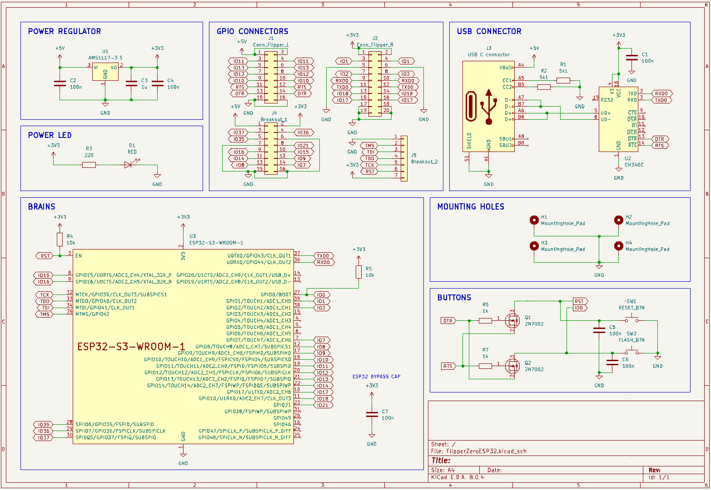
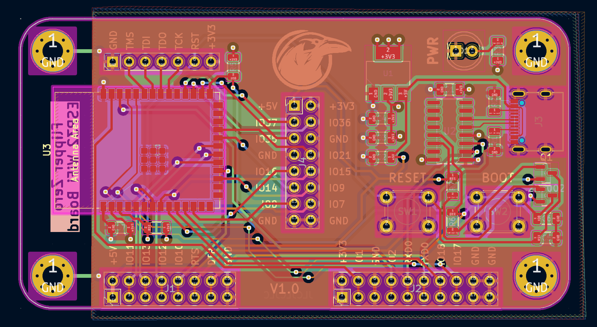
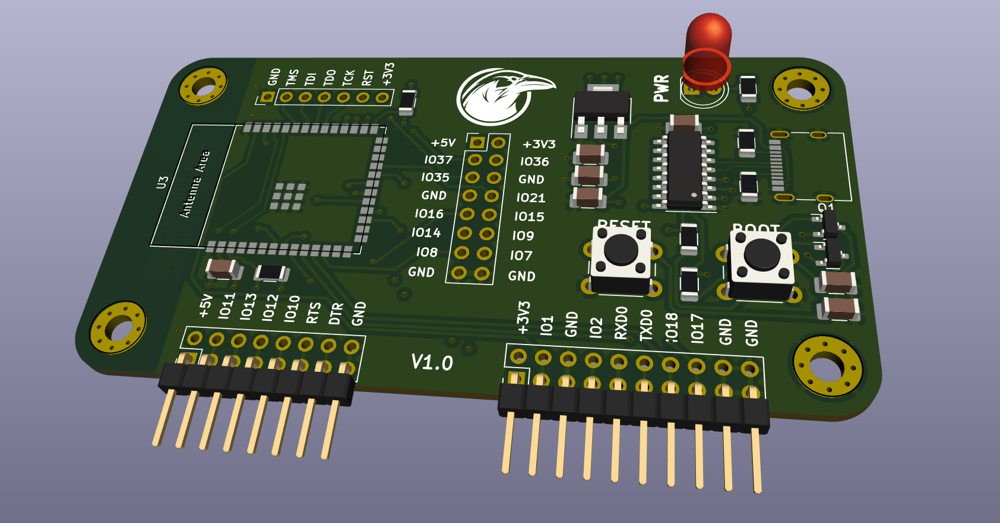
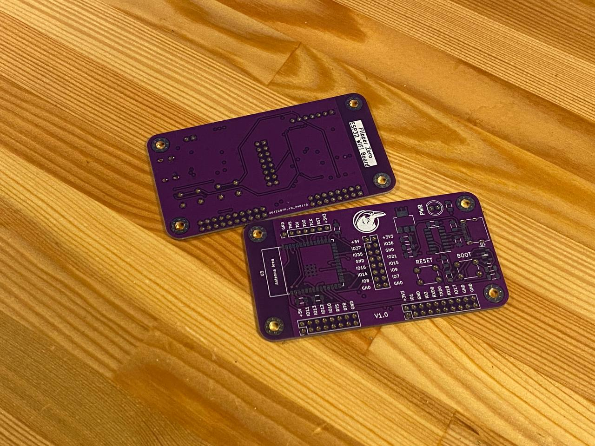

# Flipper-Zero-ESP32-GPIO-Board

A custom ESP32 board for [Flipper Zero](https://flipperzero.one/) GPIO connector. This bascially connects the ESP32 via UART to the Flipper Zero, and leaves some GPIO pins exposed for more funcitonality.

